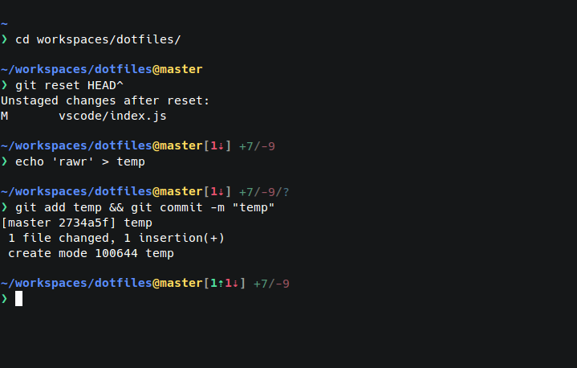

# Daniel Imms' dotfiles

My dotfiles for Linux and Windows.



## Dependencies

Node.js is required to run this project.

## Installing/syncing environment

```bash
npm install
npm start install
```

## Installing a single module

```bash
npm start install <module>
```

## Setup a Debian-based Linux box

```bash
sudo apt update && sudo apt install wget
bash <(wget -qO- https://raw.githubusercontent.com/Tyriar/dotfiles/master/scripts/setup_deb.sh)
```

## Acknowledgements

- [Nicolas Gallagher](https://github.com/necolas) - [Bash prompt script](https://github.com/necolas/dotfiles)
- [Ron Waldon](https://github.com/jokeyrhyme) - [Font install script](https://github.com/jokeyrhyme/dotfiles)
